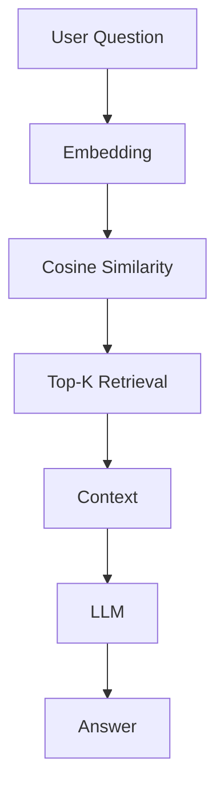
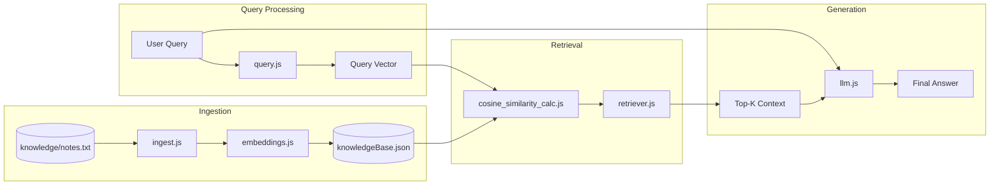
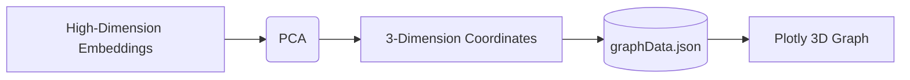

# RAG Basic Pipeline

This project is an educational repository designed to teach developers how a Retrieval-Augmented Generation (RAG) pipeline works by implementing every major step manually. Instead of relying on opaque frameworks or vector databases, this project exposes the core mechanics of ingestion, embedding generation, similarity search, and answer generation from scratch. The goal is to provide a transparent, beginner-friendly foundation for understanding the complete execution flow of RAG.

---

## Features

- **Document Ingestion:** Manual parsing and chunking of text files into processable segments.
- **Embedding Generation:** Integration with OpenAI API to convert text chunks and user queries into dense vector representations.
- **Manual Similarity Search:** From-scratch mathematical implementation of cosine similarity to rank and retrieve relevant context.
- **Context-Aware Generation:** Construction of customized LLM prompts that restrict the language model to answering strictly based on retrieved information.
- **Dimensionality Reduction & Visualization:** Uses Principal Component Analysis (PCA) to project high-dimensional embeddings into a 3D space for visual interpretation.

---

## Project Architecture

The architecture follows a strict sequential flow, isolating each responsibility of the RAG pipeline into its own distinct module.

### Main Pipeline



### Complete RAG Pipeline



---

## Folder Structure

- **`ingest.js`**: Reads raw knowledge documents (`knowledge/notes.txt`) and splits the text into manageable chunks.
- **`embeddings.js`**: Connects to the OpenAI API to create vector embeddings for the text chunks. It saves the resulting vectors to `knowledgeBase.json` and exports a helper function to generate embeddings for user queries.
- **`query.js`**: The main execution script for interacting with the pipeline. It prompts the user for a question, generates a query embedding, orchestrates the retrieval process, and calls the language model.
- **`retriever.js`**: Compares the query embedding against all embeddings in the knowledge base, computes their similarity scores, and retrieves the Top-K most relevant chunks.
- **`llm.js`**: Takes the user's question and the retrieved text chunks, formats them into a strict instructional prompt, and sends it to the language model to generate a final answer.
- **`visualize.js`**: Loads the embeddings from the knowledge base and a sample query, runs Principal Component Analysis (PCA) to reduce their dimensions to 3, and exports the coordinates to `graphData.json`.
- **`cosine_similarity_calc.js`**: A manual, dependency-free mathematical implementation of the cosine similarity algorithm used to measure the distance between vectors.
- **`knowledgeBase.json`**: A local JSON file acting as a mock database. It stores the original text chunks alongside their corresponding high-dimensional vector embeddings.
- **`graphData.json`**: Stores the reduced 3D coordinates generated by PCA, which are consumed by the frontend for visualization.
- **`index.html`**: A simple web interface utilizing Plotly to render the 3D embedding space from `graphData.json`.

---

## End-to-End Execution Flow

When you run the project, the following sequence of events occurs:

1. **Read knowledge files**: The text from the knowledge file is read.
2. **Chunk text**: The raw text is split line-by-line into an array of chunks (`ingest.js`).
3. **Generate embeddings**: The application sends these text chunks to OpenAI's embedding model (`embeddings.js`) and stores them in `knowledgeBase.json`.
4. **Accept query**: The application waits for the user to input a question via the terminal (`query.js`).
5. **Embed query**: The user's text question is sent to OpenAI to generate a single query vector of the exact same dimensions as the knowledge base vectors.
6. **Calculate similarity**: The query vector is mathematically compared against every vector in the knowledge base using the cosine similarity formula (`cosine_similarity_calc.js`).
7. **Retrieve Top-K chunks**: The chunks are sorted descending by their similarity score, and the most relevant chunks are extracted (`retriever.js`).
8. **Construct prompt**: A prompt is dynamically constructed containing both the user's original question and the text of the retrieved chunks.
9. **Generate answer**: The prompt is sent to the LLM (`llm.js`), which generates and returns the final answer.

---

## Mathematical Concepts

### Embeddings
An embedding is a way to represent the meaning of text as an array of numbers (a vector). Words, sentences, or entire paragraphs that share similar meanings or contexts will result in vectors that are plotted close to each other in a mathematical space.

### Cosine Similarity
Cosine similarity is a mathematical formula that measures how similar two vectors are. Instead of measuring the physical distance between two points, it measures the angle between them. 
- A score of `1` means the vectors point in the exact same direction (highly similar).
- A score of `0` means they are perpendicular (unrelated).
- A score of `-1` means they point in opposite directions.

### PCA
Embeddings often consist of thousands of dimensions (e.g., 1,536). PCA is a mathematical technique that compresses these numbers down to 2 or 3 dimensions while attempting to preserve the most important relationships and variances between the data points. 

---

## Visualization

This project includes a visualization script (`visualize.js`) and a web interface (`index.html`) to help you visually understand how the vector space operates.



**Why PCA is used:** We use PCA strictly to map the data onto a 3D graph so that we can visually inspect how the query relates to the surrounding text chunks.

**Why retrieval DOES NOT use PCA:** The retrieval system evaluates similarity using the original high-dimensional vectors. Performing search on the reduced 3D PCA coordinates would result in significant accuracy loss. 

**Projection distortion:** Much like flattening a globe onto a 2D map distorts the true size of continents, flattening 1,536 dimensions into 3 dimensions introduces severe spatial distortion. While nearby points on the 3D graph often indicate semantic similarity, the visible distances are approximations and should not be treated as exact mathematical truths. 

**Note:** Cosine similarity always operates in the original embedding space.

---

## Running the Project

### Installation

Clone the repository and install the required dependencies:
```bash
npm install
```

### Environment Variables

Create a `.env` file in the root directory and add your OpenAI API key:
```env
YOUR_OPENAI_API_KEY=sk-your-openai-api-key-here
```

### Commands

**1. Generate the Knowledge Base**
```bash
node embeddings.js
```

**2. Ask a Question**
```bash
node query.js
```

**3. Generate Visualization Data**
```bash
node visualize.js
```
After running this, open `index.html` in your web browser to view the 3D embedding graph.

---

## Example

**User Query:**
```text
Ask a question: Who created JavaScript?
```

**Retrieved Chunks:**
```text
1. "JavaScript was created by Brendan Eich in 1995."
2. "It was originally developed for Netscape Navigator."
```

**Generated Answer:**
```text
Answer:
JavaScript was created by Brendan Eich in 1995.
```

---

## Future Improvements

To transition this basic pipeline into a production-ready system, the following concepts would need to be implemented:
- **Use LangChain for pdf uploads and Abstraction of Embeddings**
- **Vector Database**
- **Metadata Filtering**
- **Chunk Overlap**
- **Hybrid Search**
- **Better Embedding Models**
- **Streaming Responses**

---

## 📚 Learning Resources

### My Blog

- **Understanding the limitations of RAG (recommended first read)**  
  https://krizh.hashnode.dev/where-rag-fails-understanding-the-limitations-of-retrieval-augmented-generation

---

### Official Documentation

- **OpenAI Embeddings (`text-embedding-3-small`)**  
  https://developers.openai.com/api/docs/models/text-embedding-3-small :contentReference[oaicite:0]{index=0}

- **Qdrant Documentation**  
  https://qdrant.tech/documentation/ :contentReference[oaicite:1]{index=1}

- **How Vector Search Works (Qdrant)**  
  https://qdrant.tech/documentation/overview/vector-search/ :contentReference[oaicite:2]{index=2}

- **Vectors in Qdrant**  
  https://qdrant.tech/documentation/manage-data/vectors/ :contentReference[oaicite:3]{index=3}

---

### Research Papers

- **Retrieval-Augmented Generation for Knowledge-Intensive NLP Tasks (RAG Paper)**  
  https://arxiv.org/abs/2005.11401

- **REALM: Retrieval-Augmented Language Model Pre-Training**  
  https://arxiv.org/abs/2002.08909

- **Atlas: Few-shot Learning with Retrieval Augmented Language Models**  
  https://arxiv.org/abs/2208.03299

- **HyDE: Precise Zero-Shot Dense Retrieval without Relevance Labels**  
  https://arxiv.org/abs/2212.10496

---

### Learn More

- **LangChain RAG Tutorials**  
  https://python.langchain.com/docs/tutorials/rag/

- **LlamaIndex Documentation**  
  https://docs.llamaindex.ai/

- **Pinecone Learn**  
  https://www.pinecone.io/learn/

- **Chroma Documentation**  
  https://docs.trychroma.com/

- **FAISS Documentation**  
  https://faiss.ai/
